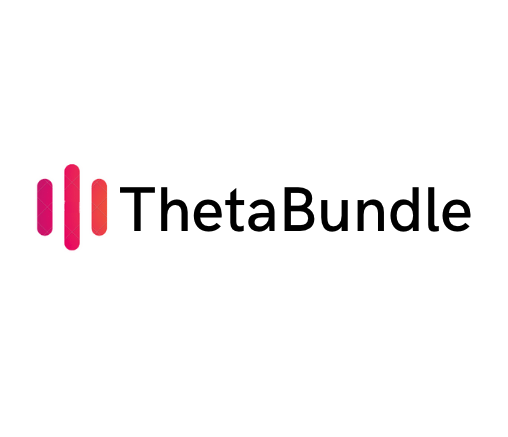

    

## ClippedNFT

ClippedNFT allows content creators to monetize 'clips' of their video or gaming content using Theta Smart contracts and NFTs.

## Inspiration

Existing streamers often have large followings and post their content to youtube or other sites after streaming on live networks like Twitch - but that could be the end of it. Given these followings, we want to provide an opportunity to further connect with fans by providing memorabilia, and providing an additional revenue opportunity for the content creator. ClippedNFT allows any streamer to turn 'clips' of their streamed content into a sellable NFT and IPFS video upload.

These collections can also be later resold and traded by new owners.

Many NFT platforms exist, but:

* There's not a dominant one that appeals to the streaming (gaming and non-gaming) streaming market.
* May not integrate with existing streaming networks. ClippedNFT doesn't care how you broadcast, only that the uploaded listings have a particular format and content.
* Have higher overhead - contentstream backed by LivePeer and allows you to re-use existing assets and content if you wish.
Many streamers are already into technology and can port their existing streams onto the platform.
* ClippedNFT is a niche platform not focused on current categories like artwork/real estate - only video content.

<b>This project is a hackathon prototype and would require additional work / deployment to be production ready.</b>

## Setup

### Project structure

`/contracts`: Smart contracts for the ClippedNFT application.
`/img`: Example screenshots.

The root directory is the client. Deploy to the Theta testnet (default config).

The following environment variables are required:

<pre>
    REACT_APP_STORAGE_KEY={YOUR_WEB3_STORAGE_KEY}
</pre>

### Connecting to Theta

Network Name: Theta Testnet
New RPC URL: https://eth-rpc-api-testnet.thetatoken.org/rpc
Chain ID: 365
Currency Symbol: TFUEL
Block Explorer URL: https://explorer.thetatoken.org/

Network Name: Theta Mainnet
New RPC URL: https://eth-rpc-api.thetatoken.org/rpc
Chain ID: 361
Currency Symbol: TFUEL
Block Explorer URL: https://explorer.thetatoken.org/

## How we built it

- Website based on ReactJS.
- Integration with web3 using metamask and theta networks.

## Challenges we ran into

- Integrating theta networks with metamask deployer.

## Accomplishments that we're proud of

- Works and contract deploys with an upload stream or video file!

## Potential future work
- Monetization strategy (ClippedNFT could take a fee from NFT sales).
- Production deployment.

<!--
Demo:

-->

### Network config

Network Name: Theta Testnet
New RPC URL: https://eth-rpc-api-testnet.thetatoken.org/rpc
Chain ID: 365
Currency Symbol (optional): TFUEL
Block Explorer URL (optional): https://testnet-explorer.thetatoken.org/

---

Network Name: Theta Mainnet
New RPC URL: https://eth-rpc-api.thetatoken.org/rpc
Chain ID: 361
Currency Symbol (optional): TFUEL
Block Explorer URL (optional): https://explorer.thetatoken.org/

### Useful links

- https://sersi.es/tutorial_nft_en.pdf
- https://github.com/jacobedawson/connect-metamask-react-dapp
- https://docs.thetatoken.org/docs/web3-stack-metamask
