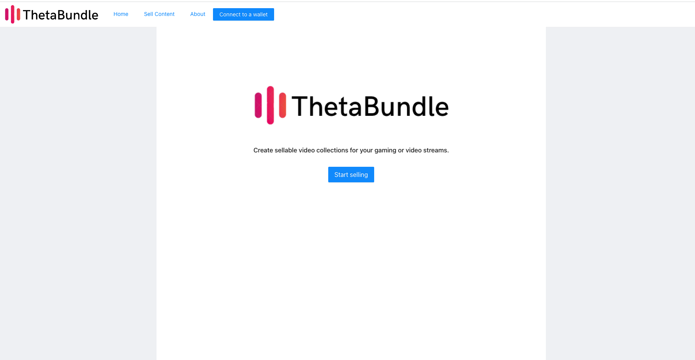

    

## ThetaBundle

ThetaBundle allows content creators to sell bundles/rights to their video or gaming content via transactable Theta smart contracts.

Built for the Theta Q1 2022 Hackathon.

* Chris Buonocore linkedin.com/in/chrisbuonocore United States
* chrisdistrict@gmail.com
* Categories: Video / Gaming / Smart contracts

Live demo: https://thetabundle.netlify.app/

## Inspiration

Existing streamers often have large followings and post their content to youtube or other sites after streaming on live networks like Twitch - but that could be the end of it. Given these followings, we want to provide an opportunity to further connect with fans by providing memorabilia, and providing an additional revenue opportunity for the content creator. ThetaBundle allows any streamer to turn collections of their streamed content into a purchase-able contract and IPFS video group.

These collections can also be later resold and traded by new owners.

Many video marketplace platforms exist, but:

- There's not a dominant one that appeals to the streaming (gaming and non-gaming) streaming market.
- May not integrate with existing streaming networks. ThetaBundle doesn't care how you broadcast, only that the uploaded listings have a particular format and content.
- Have higher overhead - contentstream backed by LivePeer and allows you to re-use existing assets and content if you wish.
  Many streamers are already into technology and can port their existing streams onto the platform.
- ThetaBundle is a niche platform not focused on current categories like artwork/real estate - only video content.

<b>This project is a hackathon prototype and would require additional work / deployment to be production ready.</b>

## Setup

### Project structure

`/contracts`: Smart contracts for the ThetaBundle application.
`/img`: Example screenshots.

The root directory is the client. Deploy to the Theta testnet (default config).

The following environment variables are required:

<pre>
    REACT_APP_STORAGE_KEY={YOUR_WEB3_STORAGE_KEY}
</pre>

### Connecting to Theta

Network Name: Theta Testnet
New RPC URL: https://eth-rpc-api-testnet.thetatoken.org/rpc
Chain ID: 365
Currency Symbol: TFUEL
Block Explorer URL: https://testnet-explorer.thetatoken.org/

Network Name: Theta Mainnet
New RPC URL: https://eth-rpc-api.thetatoken.org/rpc
Chain ID: 361
Currency Symbol: TFUEL
Block Explorer URL: https://explorer.thetatoken.org/

Update `ACTIVE_NETWORK` in `constants.js` to reflect the target network for the smart contract deployments. One contract is created for each listing with a direct link to the video clip stored on IPFS.

## How we built it

- Website based on ReactJS.
- Integration with web3 using metamask and Theta.
- Smart contract using Solidity deployed to Theta testnet/mainnet.

## Challenges we ran into

- Integrating theta networks with metamask deployer.

## Accomplishments that we're proud of

- Works and contract deploys with upload streams or video files correctly linked!

## Potential future work

- Monetization strategy (ThetaBundle could take a fee from contract sales).
- Production deployment.

### Screenshots
<h3>Search/Home</h3>

<h3>Specify terms of ThetaBundle contract</h3>

<h3>Adding video files</h3>

<h3>ThetaBundle created!</h3>

<h3>Deploying a bundle contract</h3>

<h3>Deployed contract on Theta testnet</h3>

<h3>Completing payment</h3>

<h3>About</h3>

<!--
Demo:

-->

Example contract: http://localhost:3000/0x36FBf31c9E4dcE0Af4b917D10a884cDC71Fb5854

### Network config

Network Name: Theta Testnet
New RPC URL: https://eth-rpc-api-testnet.thetatoken.org/rpc
Chain ID: 365
Currency Symbol (optional): TFUEL
Block Explorer URL (optional): https://testnet-explorer.thetatoken.org/

---

Network Name: Theta Mainnet
New RPC URL: https://eth-rpc-api.thetatoken.org/rpc
Chain ID: 361
Currency Symbol (optional): TFUEL
Block Explorer URL (optional): https://explorer.thetatoken.org/

### Recompiling contracts

From the `/contracts` directory:
`yarn; truffle compile`

### Useful links

- https://sersi.es/tutorial_nft_en.pdf
- https://github.com/jacobedawson/connect-metamask-react-dapp
- https://docs.thetatoken.org/docs/web3-stack-metamask
